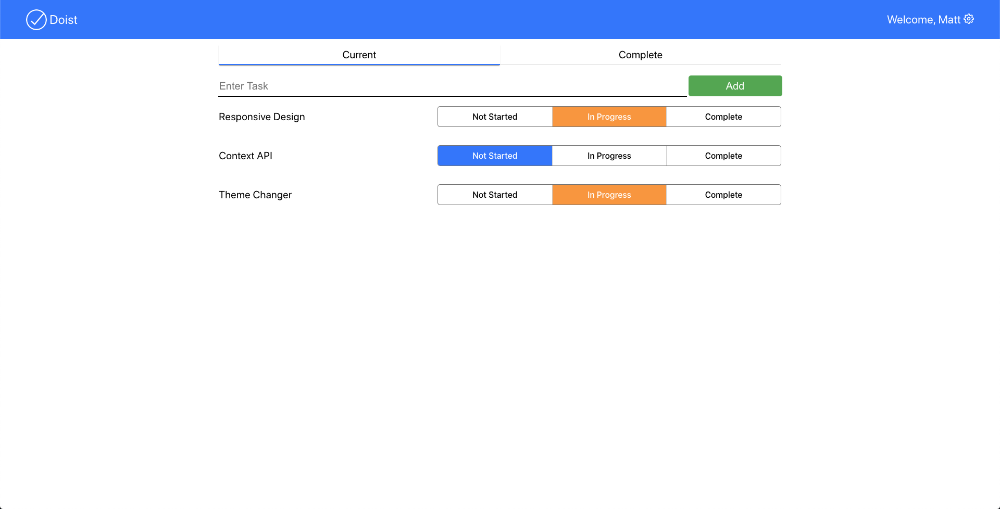

# Welcome to Doist

Doist is a simple task management developer portfolio project. On this application, users are able to add a username, create tasks, manage tasks progress, and more. This project features the use of React, React Hooks (including useState, useEffect, and useContext), the React Context API, and Sass/SCSS. This project also features working with localStorage to store user tasks.

[Click here](https://doist-developer-project.netlify.app/#/) to view the live site.

